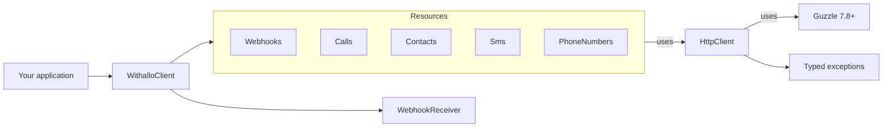
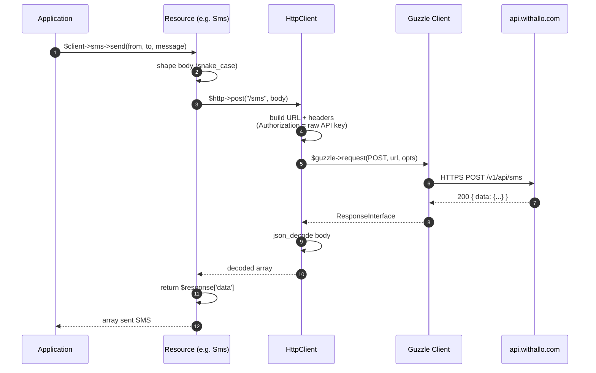
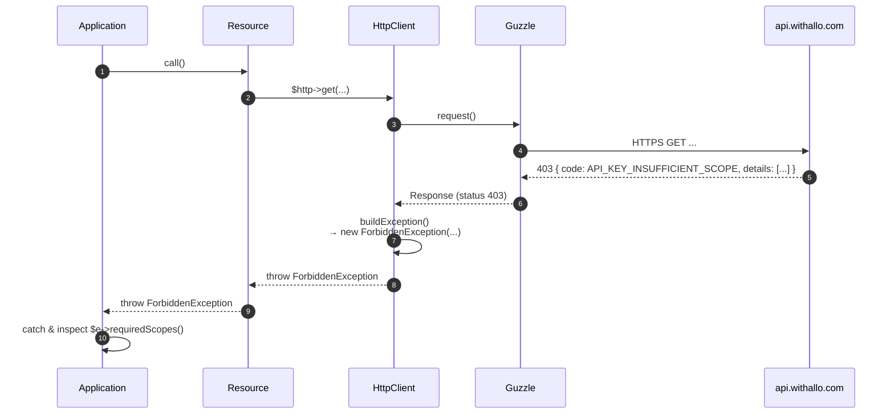
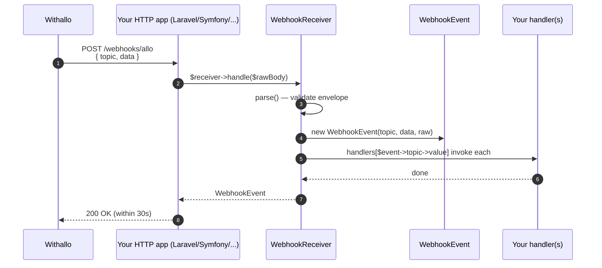
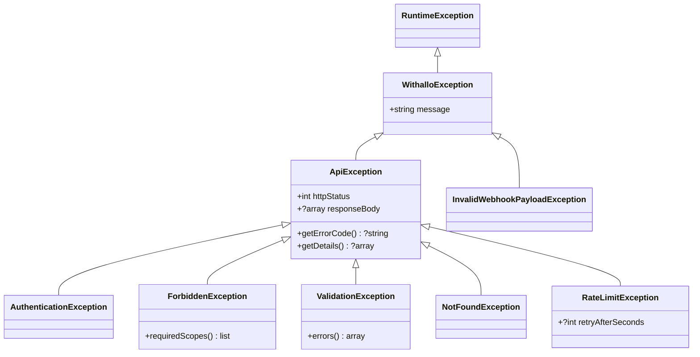

# Architecture — `qrcommunication/withallo-sdk` (PHP)

This document describes the architecture of the PHP SDK in depth. For a task-oriented quick start, see the root [README](../README.md). For the raw Withallo API contract, see [openapi.yaml](./openapi.yaml).

## High-level layers



Key properties:

- **`WithalloClient`** is the public entry point. Constructing it builds exactly one `Config`, one `HttpClient`, and one instance of each resource. Resources share the same `HttpClient` through constructor injection.
- **Resources** are thin adapters that know *which* path / verb to call and *how* to shape the request/response array; they contain **no network logic**.
- **`HttpClient`** is the single place where Guzzle is invoked, headers are set, and HTTP error codes are translated into typed exceptions.
- **`WebhookReceiver`** is stateless and independent of `HttpClient` — parsing and dispatching incoming payloads does not need the network.

## Request lifecycle (outbound REST call)



Error path (e.g. 403):



## Incoming webhook pipeline



Failures in `parse()` throw `InvalidWebhookPayloadException`.

## Namespace layout

```
src/
├── WithalloClient.php       — public entry point
├── Config.php               — immutable runtime configuration
├── HttpClient.php           — Guzzle wrapper
├── Enums/
│   ├── Environment.php
│   ├── Scope.php
│   ├── WebhookTopic.php
│   ├── CallResult.php
│   ├── CallType.php
│   ├── SmsType.php
│   └── SmsDirection.php
├── Exceptions/
│   ├── WithalloException.php
│   ├── ApiException.php
│   ├── AuthenticationException.php
│   ├── ForbiddenException.php
│   ├── ValidationException.php
│   ├── NotFoundException.php
│   ├── RateLimitException.php
│   └── InvalidWebhookPayloadException.php
├── Resources/
│   ├── Resource.php         — abstract base (http injected)
│   ├── Webhooks.php
│   ├── Calls.php
│   ├── Contacts.php
│   ├── Sms.php
│   └── PhoneNumbers.php
└── Webhooks/
    ├── WebhookEvent.php
    └── WebhookReceiver.php
```

### Where the boundaries are enforced

| Layer | Depends on | Forbidden imports |
|-------|------------|-------------------|
| `Resources/*` | `HttpClient`, `Enums/*` | `WithalloClient` |
| `HttpClient` | `Config`, `Exceptions/*` | any resource |
| `Webhooks/*` | `Enums/*`, `Exceptions/*` | `HttpClient`, any resource |

## Error architecture



## Extension points

| Use case | Knob |
|----------|------|
| Custom Guzzle client (logging, retry middleware) | Inject a pre-built `HttpClient` via `WithalloClient(... httpClient: ...)` |
| Mock for tests | `tests/Support/MockHttpClient` wires a Guzzle `MockHandler` and records requests |
| Custom User-Agent | `userAgent:` parameter |
| Timeouts | `timeout:` and `connectTimeout:` parameters (seconds) |

Example with Guzzle middleware (retry on 5xx + structured logging):

```php
use GuzzleHttp\Client;
use GuzzleHttp\HandlerStack;
use GuzzleHttp\Middleware;
use GuzzleHttp\MessageFormatter;
use QrCommunication\Withallo\Config;
use QrCommunication\Withallo\HttpClient;
use QrCommunication\Withallo\WithalloClient;

$stack = HandlerStack::create();
$stack->push(Middleware::log($logger, new MessageFormatter('{method} {uri} -> {code}')));
$stack->push(Middleware::retry(
    decider: fn (int $retries, $req, $res = null, $err = null) =>
        $retries < 3 && ($err || ($res && $res->getStatusCode() >= 500)),
    delay: fn (int $retries) => 1000 * 2 ** $retries,
));

$guzzle = new Client(['handler' => $stack, 'timeout' => 15]);

$config = new Config(apiKey: $_ENV['WITHALLO_API_KEY']);
$httpClient = new HttpClient($config, $guzzle);

$client = new WithalloClient(
    apiKey: $_ENV['WITHALLO_API_KEY'],
    httpClient: $httpClient,
);
```

## Testing strategy

- **Unit scope**: PHPUnit 11 with Guzzle `MockHandler` queued with canned responses. Outgoing requests are recorded and asserted via `tests/Support/MockHttpClient`.
- **Static analysis**: PHPStan level 8 (`composer analyse`).
- **Format**: Laravel Pint (`composer lint` / `composer lint-check`).
- **Live smoke test**: see `docs/examples/live-smoke-test.php` (runs against a real API key).

## Security model

| Concern | Mitigation |
|---------|------------|
| API key leakage | Key lives only in `.env` / secret store — never in source, never logged. |
| Webhook spoofing | Withallo does not ship an HMAC today. Use a secret URL path + `allo_number` whitelist from `$client->phoneNumbers->list()`. |
| Dependency vulnerabilities | Only `guzzlehttp/guzzle ^7.8` at runtime. Dev deps tracked via Dependabot. |
| PHP supply chain | `composer.lock` committed and audited via `composer audit` in CI. |
